# Git  VCS 
- version control sytem 

## basic commands
- git status 
- git add fileName
- git commit -m "Comment"
- git log
- git checkout -> return to the snapshot you want from the file.
- git clone reposlink "using ssh or https"
- git push 
- git pull 

## Branching 
- git branch 
- git switch branchName.

## Merging 
	the counter of branching 
	if you want to merge the main branch to develop branch 
	- go to develop branch then git merge.
- git merge branchName.

## Forking 
	the remote clone inside github is called forking
	
## open source contributing scenario
- fork the repos to your github account 
- clone it in you local machine 
- commit to it 
- push to your account 
- send pull request to the main project author.
- if they revies it and like it, it accept the pull request
- 

## some traker 
- bug tracker like bugzila
- project tracker like jira
- build tracker like jenkins
- communication tool like slack, microsoft teams.
- cloud providers like Aure, AWS and heorkuo.

## brief for version control system 
- client server control system 
	- subversion
- distributed versio control 
	- git 
	- some other version control sytem 

#### Note 
	- there is a property to break up the project to small pieces called shallow clone.
	- git is so powerful with text file, but not binary file cuz it take a large space from disk.

## Github full picture
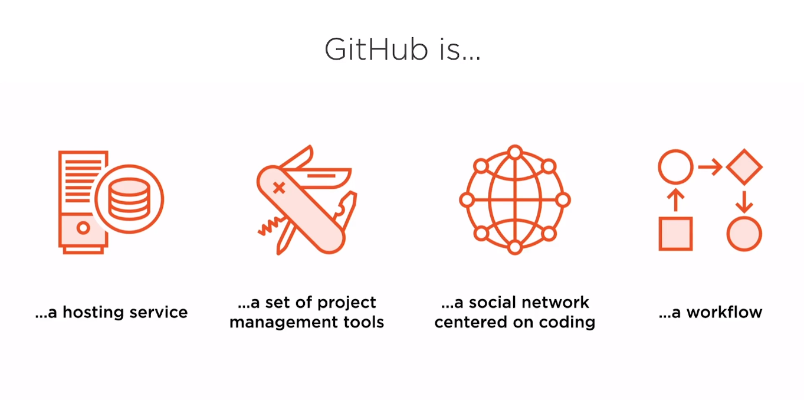

---

## Git in action 
### The 3 state of file
- commited
- modified 
- staged 
i think it like a loop from upside to downside
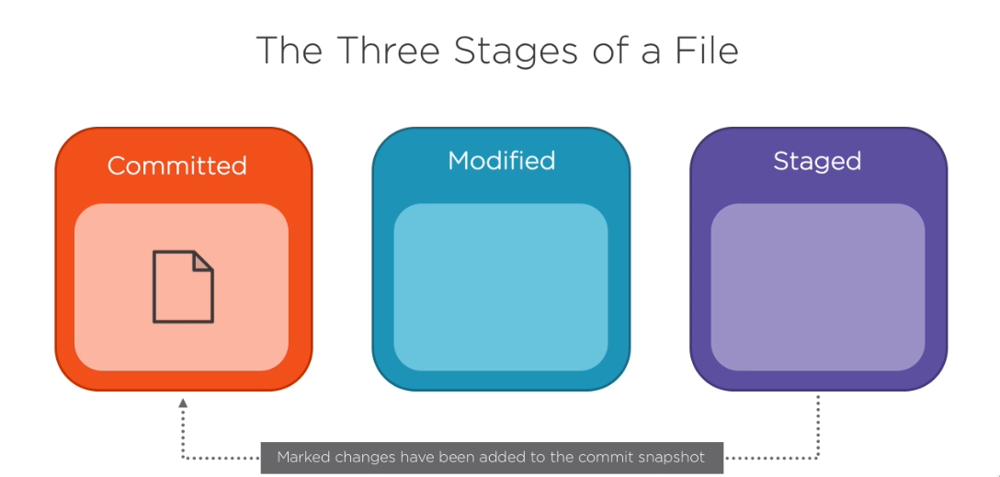

### The 3 state of a git project 
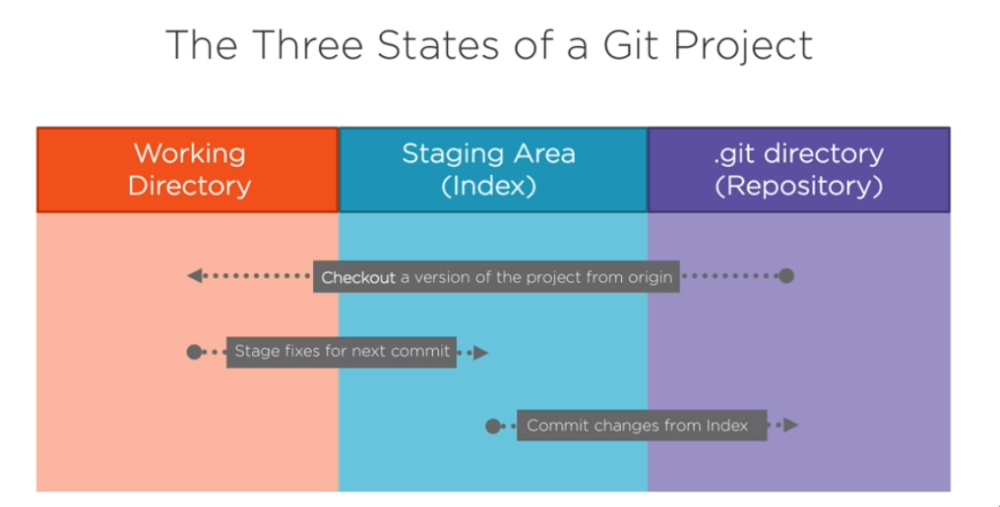

---
## Git from start 
- git --version -> check you install git by correct way.
#### configuration for git
  - git config --global  user.name "yourName"
  - git  config --global user.email "yourMail"
#### to see all configuration have been set
 - git config --list
#### to see help menu 
- man git 
- git -h 
- git --help
- git help
#### init the git repos
- git init

#### git remote
- git remote add origin link 

#### git push 
- git push -u origin masterORmain

#### now we work with real scenario talking about file .
- change file so it will be untracked that's modified 
- we want to track it, so add it that's staged 
- commit it to snapshot that's commit.

1- git status -s / git status --short
2- git add . / git add fileName
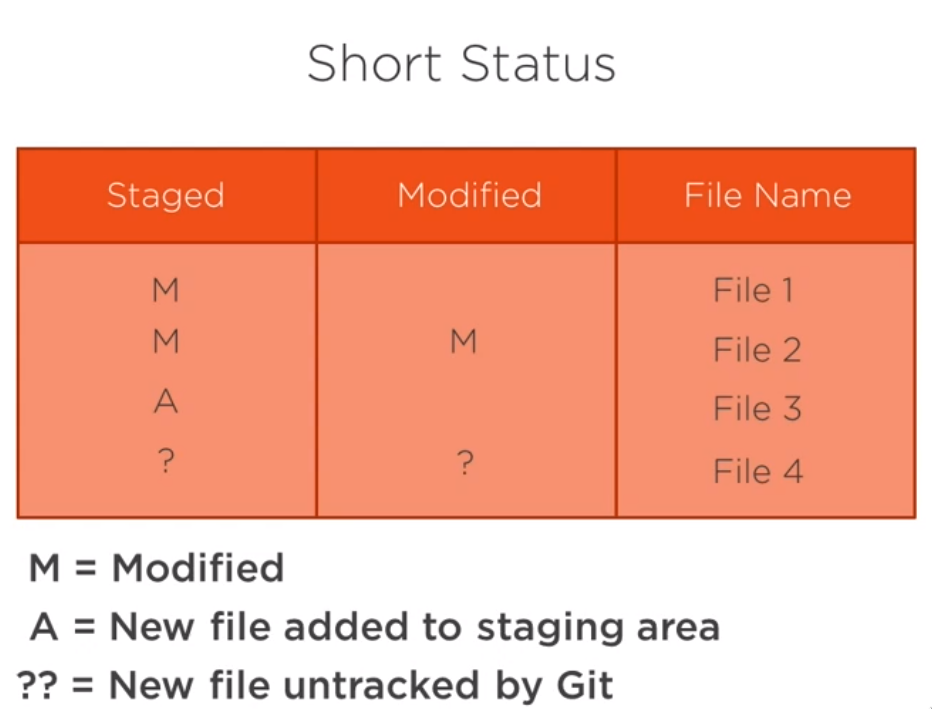
 
 #### un staged file using 
 - git reset head fileName

#### diff git 
- show us the difference between files 
- git diff --staged 
	- compared file
	- file metadata
	- change marker for the files
	- chunk header
- git diff --staged --no-renames 

#### Note Git  keep track for the file by using the hash. 

#### git commit 
- git commit -a -m " comment " -> skip staging area and go to commit directly.
- git commit -m "comment" -> from staging to commitment area
##### how to write good commit 
- [cris beams article](https://cbea.ms/git-commit/) 

#### git log 
- Note -> we git the last commit first.
- git log 
- git log -1 -> show us the on commit snapshot
- git log --oneline -> show all commit snapshot in one line .
- git log --stat -> all the info about commits.

#### git rm 
	remove the file from the git and stop tracking the file.
- git rm fileName

#### git rm --cached
	remove the file from staging area but still tracking it.
- git rm --cached fileName.
##### need to put it in working directory again.
- git stash fileName.
- git stash show
- git stash list
- git stash pop

#### git mv 
	rename the file to new name.
- git mv fileName fileNewName.

#### git branch 
- this site will help you do understand the concept of branch [git visualize](https://git-school.github.io/visualizing-git/).
##### new branch
- git branch NameOfNewBranch -> make a branch and not change to it.
- git checkout -b branchNewName -> make a branch and change to it.

##### change to another branch
- git checkout branchExitstingName.

#### git merge 
	merge branch with another branch
- git merge branchName. -> the branch you want to merge to the branch you are in it.

#### git reset 
	removing commit from .git area (repos) to index area (staging area).
- git reset --soft 
- git reset --hard
- git reset --mixed
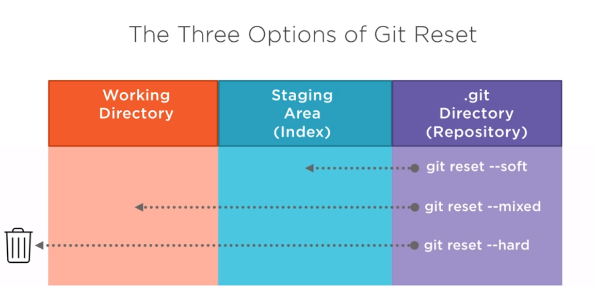

---
## How git work?
- git is high level file system built on top of your native file system
	porcelain command -> high level user command.
	plumbing commad -> used in advanced git scripting.
	
- git is just a map, a simple structure that map a key to value.
	- key is hashes.
	- value is a piece of information.
- git calculate the hash for everything using SHA1, 20 bytes in  hexadecimal , 40 hexdigit.

- git hash-object "fileName" or  echo "the phrase" | git hash-object --sdtin
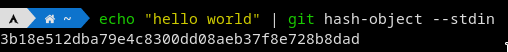

#### Some usage of plumbing commands 
	- echo "hello world" | git hash-object -stdin -w -> w for writting 
	- git cat-file hashYouWant -t or -p -> t for typeOfIt, p for prettyPrinting
	- git count-objects -> count object in .git/object folder
	
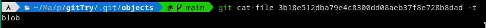
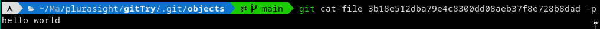

### Some dealing with .git folder  (object folder)
	commit point to tree --> tree point to blob or another tree so on.
#### Notice it will differ from user to another user .
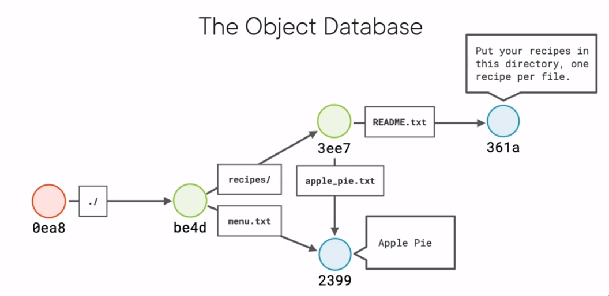

#### Notice 
- parent 
- tree
- blob

### when we talk about optimizing git is the right tool 
	if we have a big file if i edit it does git make another blob to these file? 
	answer is no --> there are some optimizing git do it, notice pack and info folders in .git/objects .
	
- there is something called annotated tag (author and so on) -> point to commit .
### In Database of objects, there are 4 types.
- annotated tags
- blob
- tree
- commit

## git from up level 

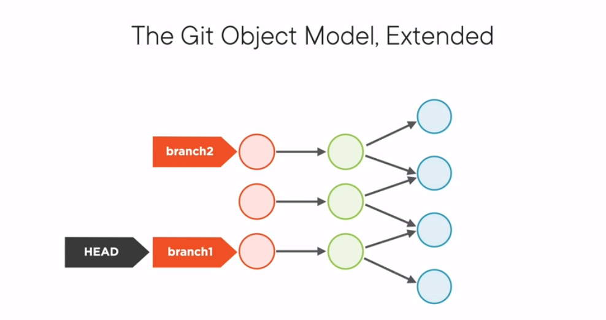
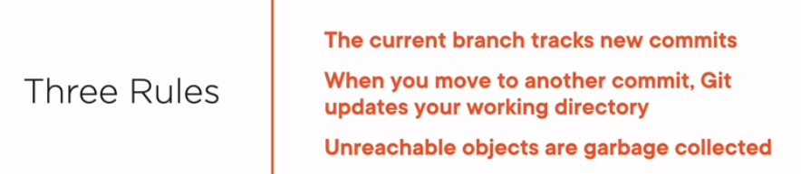
## branch from up level 
-  git put branch in .git/refs/head folder.
-  branch is just a pointer to commit
-  git branch -> to see all branches
-  git branch branchName --> make a branch 
-  there is a file called head reference to folde refs/head/fileName. 
	-  HEAD is just reference to branch .
- git switch branchName -> switch to another branch.
	-  when we swithch the HEAD is move not the branch.
	

##### Q the difference between checkout and switch.
	- switch to branch only.
	- checkout can change to commit also. called DETACHED HEAD.
		- detached head can be deleted easyly by using garbage collector.
		- but can i save them if i make a new branch for them.
- 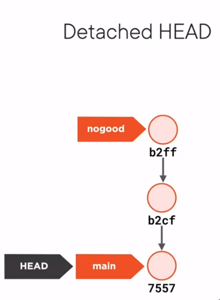

## Tag from elzero web school 
- light weight tag
	-  git tag v1.0
	-  take the message from the commit.
- anonated tag
	- git tag -a v2.0 -m "second version"
- delete tag
	-  git tag -d v1.0 --> locally
	-  git push origin  --delete v1.0

## merge 
- git merge branchName.
	 #### Note: when you get conflict
	 - solve it , add it and commit it .git will know that you are in the mid of merge.
	 - merge is a commit with two parrents.
#### note 
	fast forward - when you make merge from to different branch to each of them.
## rebasing
- git rebase main 
	#### rebasing is so tricky so :
		when we do git rebse we take copy from the file from branch with the same data and put it in the end of branch i want to rebase to it.

## The difference between merge and rebase 
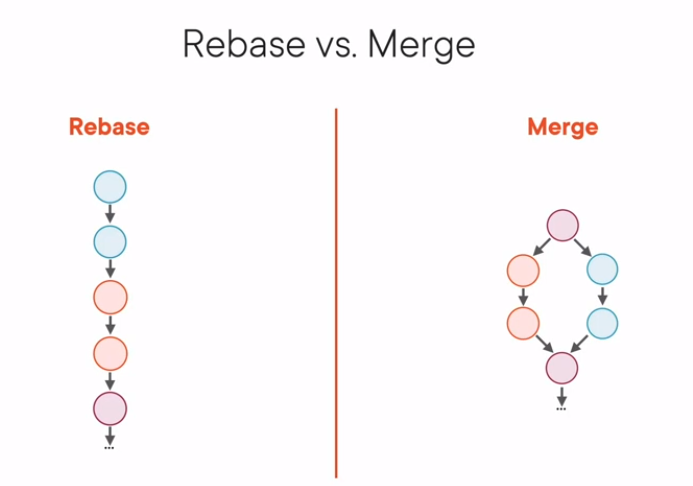

## tags 
	you can find the tag in .git/refs/tag/name

- annotated tag
	- branch like object that point to tag object that points to commit.
	-  git tag nameOfTag -a -m "commit message"
	
- soft tag 
	-  just point to commit.
	- git tag Nameoftag 
	
#### Note:
- packed-refs is so important file remote branches is packed in it git optimization.
---
note the -> git show-refs
--- 
if i add a commit to origin main and add another commit to local main; there is a conflict here so the solve:
	- git push -f -> force the push 
	
## git fetch 
- git fetch  -> after fetch from remote we want to merge main with origin main.

## git pull
	fetch followed by merge. 
- git pull 

## folk 
	remote clone from repos to your repos. so you can contribute to it.

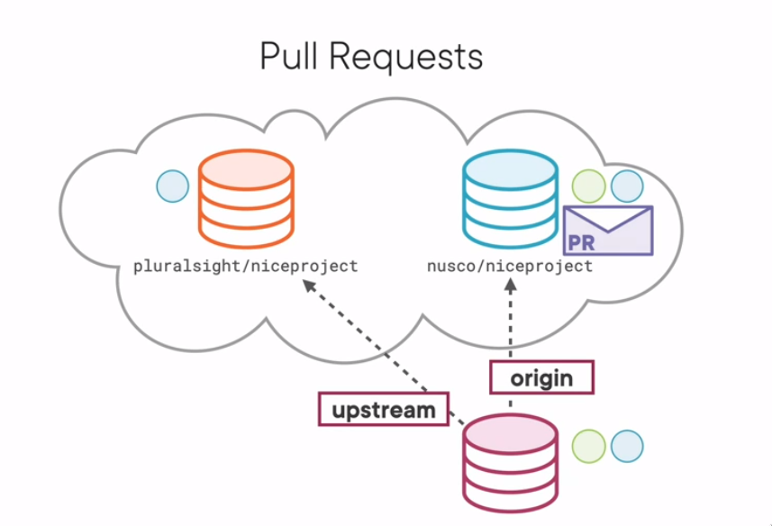

---
## Mastering Git 
### The four areas
#### intorduction
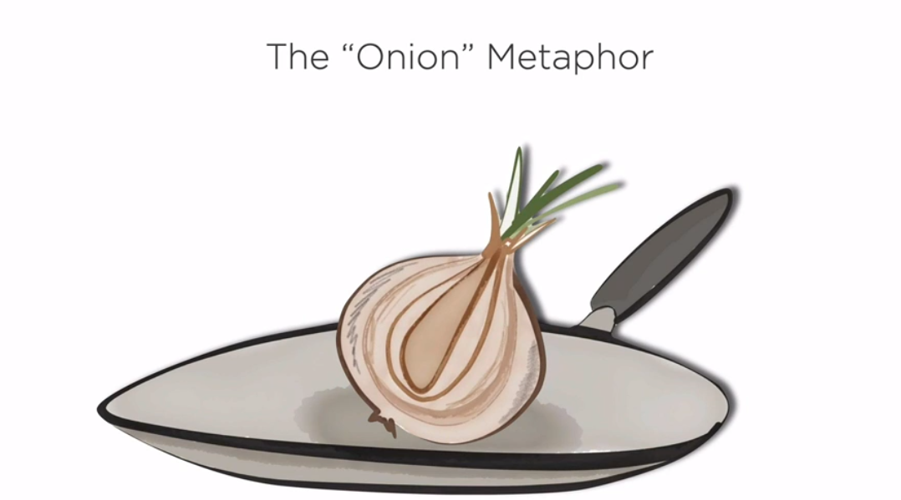
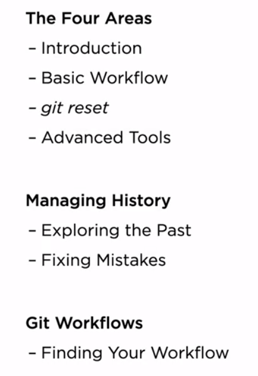
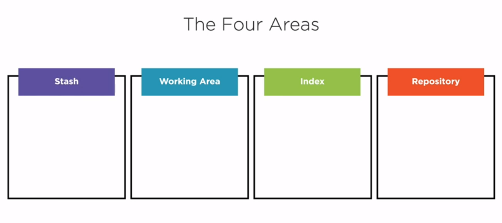

##### the most vip questions?
- how does this command move data across the four areas?
- how does this command change the repos?

- git diff --> give you the differences between two area 
	- without any argument work (working directory and indexing area)
- git diff --cached --> give you differece between two areas
	- compare indexing area with repos area.

#### basic work flow.
- we talk about checkout .
	- it change to different commit so you see different data.
	- when you checkout from branch to another HEAD move to branch you want 
		- Head  is a way to reference a commit by indirect way.
	- it copy a data from repos area to work area.
		- so you can see different data.

- we talk about remove file from index area back to work area.
	- if i make a file then add to index area and want to remove it from index but not from work area how can i do that?
		- git rm fileName --cached  --> un staged the file.

- we talk about renaming or moving file 
	- if i make file add it and commit it. now the file is in repos and working directory.
		- if i rename it, git will deal with situation as i delete the file then make a new file.
		- if i add the new file then it will be in index.
		- if i add the deleting file(nodata) then it will be in index file 
			- then git will know that i rename that file.
	- git has a solution for rename and delete at the same time.
		- git mv oldFile  newFile --> do it in work and index area. two in one.

#### git reset.
	to understand reset you need to understand the 3 main areas and git's branches.
##### command that move branches
	all these command move branches by implicit way 
- git commit
- git merge 
- git rebase 
- git pull

- the git reset command is specific for these topic.

##### what reset does?
- move the current branch.
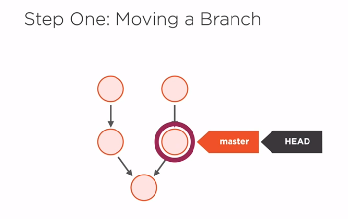
- copies data from the repos to other area.
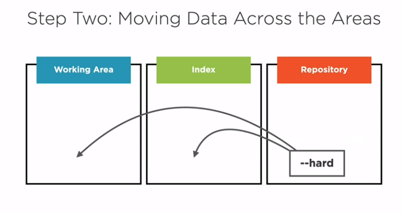
 *if you  don't put  any option to reset it will be --mixed reset.*
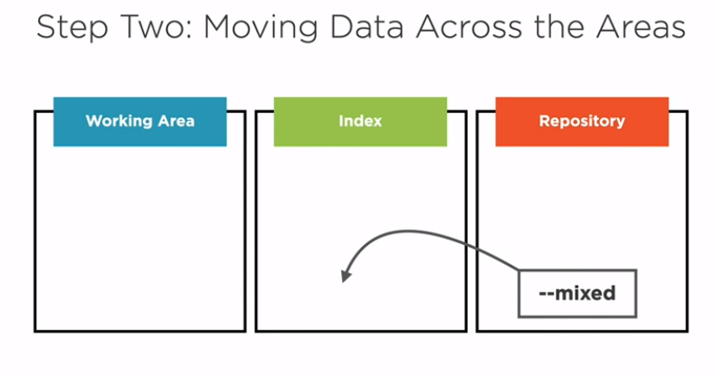
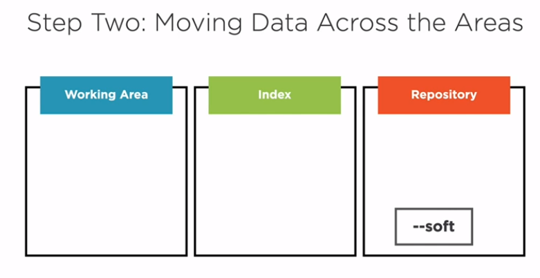

##### talk about unstaging 
- i can do it by different way .
	- git reset HEAD --> it make the file in index like the repos, reset use the default --mixed.
#### Advanced tool
##### git stash
- if you have work and you want to save it far from working area  and index area- repos reset the data to last commit.
	- git stash --include-untracked 
	- git stash list --> list all stashed list
		- stash like clipboard with more copies.
	- git stash apply --> return from stash area to working area and index area.
	- git stash clear --> clear the stash area.

##### merge conflicts 
- if we make another branch and edit file in it then switch to main edit the same file merge the branch to main -> conficts pop up 
	- how does the git status know that we are in the middle of mege ?
		- in .git folder there are many files started with merge.
- after solve the conflicts, you should tell the git that so you  use git add fileName.

##### git checkout as reset --hard
- working with file added to index area and want to unstaged it.
	- first -> git reset HEAD fileName.
	- second -> if i do git reset HEAD --hard fileName  ---> it not work
		- so we use -> git checkout HEAD  fileName.

##### committing parts of file.
- quick way (hunk by hunk)
	- git add --patch fileName.
- you can use patch with 
	- add 
	- stash
	- reset
	- checkout
##### git switch and restore  
	replace some functionality of git checkout
	
#####  git is a toolbox 

---
### History how to explore it and fix it.
#### log 
	is most powerful and complicated command you can use it to show anything related to history.
- git log --graph --decorate --oneline -> make log pretty 
- git log branchNameRecently..branchNamePrevious --> show the history difference between two branches.
#### show
- git show hashOfCommit -> show the history of commit.
##### you can think the hash is the only way to see history but there are many ways also 
- if you want to see last commit you can use 
	- ref ---> git show branchName
	- HEAD ---> git show HEAD 
- if you want to see the parent commit (IN CASE OF COMMIT HAS ONE PARENT)
	- there is no ref for it so you can do it by :-
		- git show HEAD^  --> ^ mean carret - refer to parrent of commit, ^^ refer to parent of parent.
		- git show HEAD~2 
- if you want to see the parents from two parents (IN CASE OF COMMIT HAS TWO PARRENTS).
	-	git show HEAD~2^2
- if you want to use at past time 
	- git show HEAD@{" 1 month ago "}
#### tracking changes in history 
- git blame fileName --> the line belong to which commit and the author of it.
- git diff HEAD  HEAD^2 --> show the diff between commit and past of it by two.

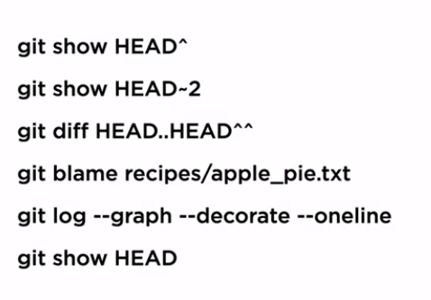

### Edit project History (fixing mistake)
	This techniques shouldnot be used on history that have been shared.-> golden rule
###### scenario edit last commit.
- if i edit file, add it and commit it. then i discover that i  not complete the mission so i want to edit the commit so :- i can use 
	- git commit --amend -> make a new commit with last one and make branch and HEAD refer to it  and the oldest commit garbage collector will take care of it.

###### Scenario Interactive rabasing -> powerfull command.
 - if i want to edit commit that i made yesterday, and i make more than 5 commits after and i want to combine it with one i do today, How can i do that?
	 - git rebase -interactive origin/master -> i decide that i will deal with commit that i pull from origin master. remember (golden rule).
		 - file will appear to it you can deal with it as you can.
		 - you can deal with squash, reword and pick :).
	- if any conflict happen you should solve it then :-
		- git add fileName.
		- git rebase -continue.

#### git reflog
	everytime a refrence move in repos git logs that move
	reflog in my opinion --> like trash on your system with all history.
- git reflog HEAD.

#### rewrite all the history of the project.
##### there are two scenario we use filter-branch
1- we puplish password to the public repos.
2- we added big file by wrong.

so we should edit that --> oh my god 

- git filter-branch (as nucler bomb) -> destructive command.
- new version of it is git filter-repos.
- git filter-repos --path fileName --invert-paths --> this mean keep all file and commits history except this file fileName.

##### Gentel command to rewrite the history.
- git revert hashToCommit. --> reverse changes in a way that's completely safe.
######
- be careful when you deal with revert when there are merges found.
---
### Finding your workflow.
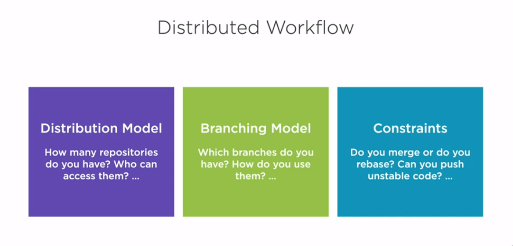

#### Distribution models
- peer to peer model
- centralized model
- pull request model
- dictator and lieutenants model

#### Branching model
 - stable and unstable branches
 - common branches
	 - integration branch (master/main)
	 - release branch
	 - feature branch
	 - hotfix branch
 ###### Scenario 
 - if you have 2 feature branch A and B, if there a commit in branch A you want to copy it to B how you did it?
	 -  git cherry-pick  -> like a rebase but for a commit 
- but if you work with the policy of merging only, how you will this problems?
	-  make another branch commit to it, then merge to branch A and B.
	-  ex
	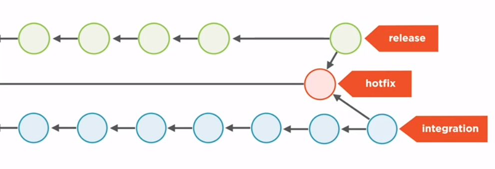
	
#### Constraints
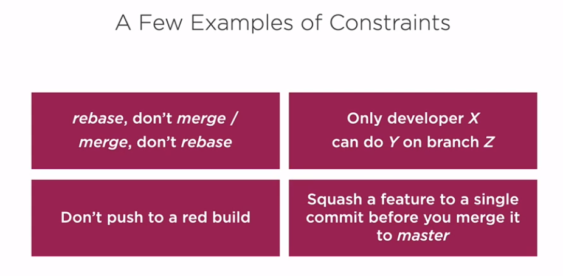

#### git work flow 
- there is an [aritcle](https://nvie.com/posts/a-successful-git-branching-model/) was written by Vincent Driessen explained the topic, take look.
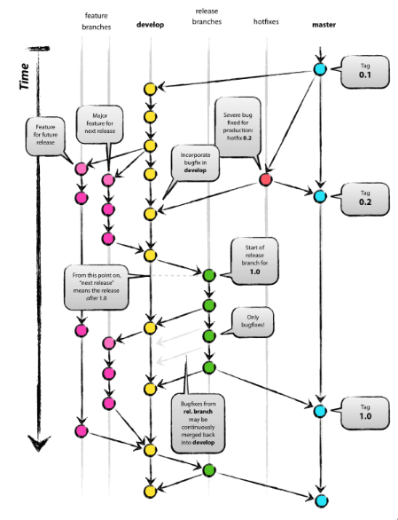
	
#### Growing a workflow
![[growingAworkFlow.png]]
																												Best wishes
																												Noureddine

---
