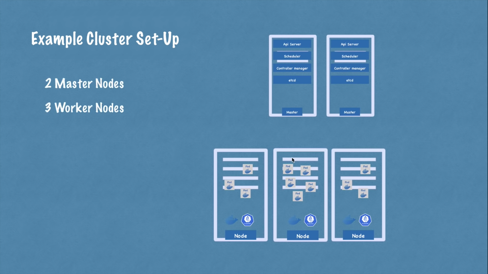
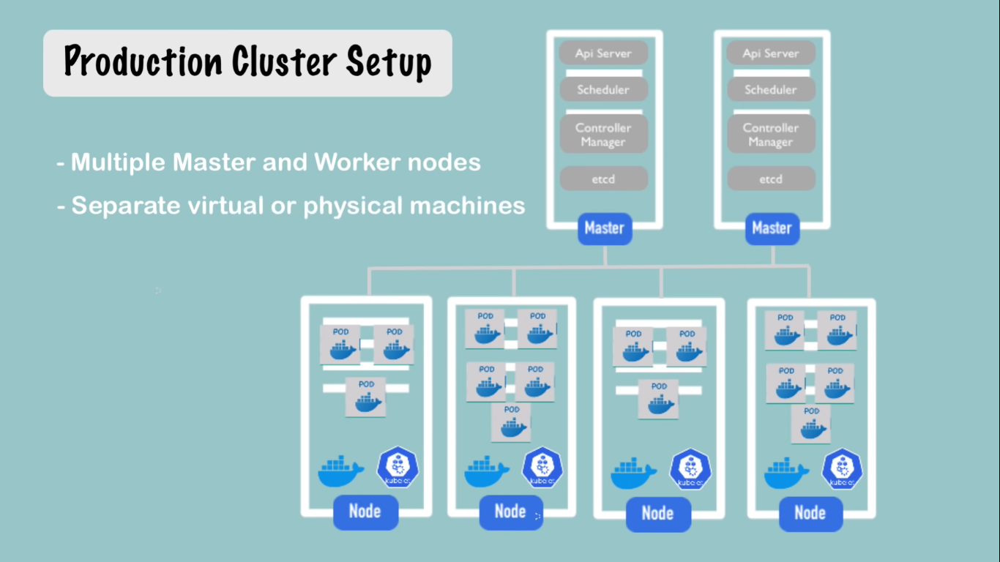
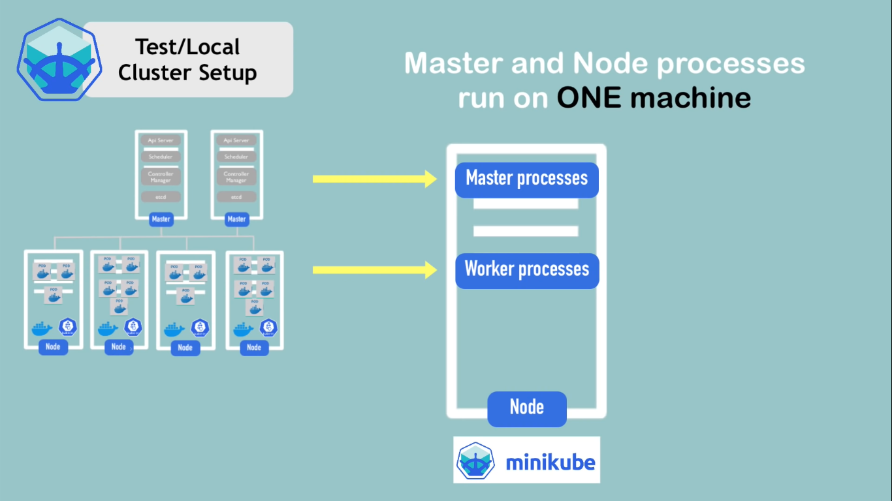
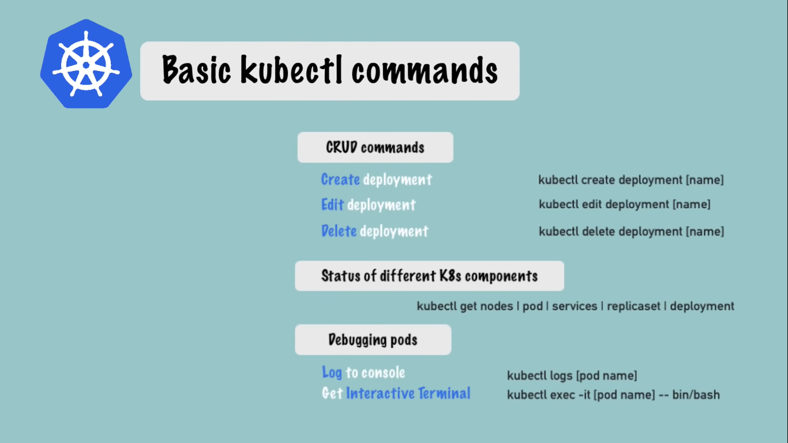
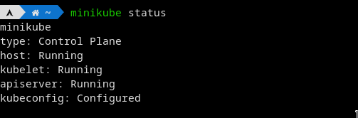
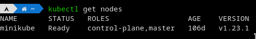

# Kubernetes 

## k8s main components.
-> pod 
- smallest unit of k8s 
- abstraction over container.
- usually 1 app per pod.
- each pod gets its own ip address.
- new ip address on re-creation.

-> service
- permenant ip
- life cycle of pod and service not connected.
-> ingress 
- if you want to request the database from outside you should use ingress to forward the request .
- service is also work as load balancer->(load balancer mean that the service catch the request and forwatd to the pod the less busy).
- route traffic into cluster.

-> config map 
- external configuration of your application.

-> secret 
- like config map but use to store secret data. 
- store in 64 base encoded.

-> volumes
- attach you to physical storage can be in your local machine or remote storage (cloud ...etc).
- so when database restart all the data will be there.
- k8s doesn't guarntee the presistance of data.
- so you use the exteranl hard drive called storage.

-> deployment 
- is a blue print for the pod of the app. 
- you not work with pod you work with deployment so you can controll how replica you want -> you can scale up or scale down the number of replica you want.
- database can't be replicated by deployment cuz it has a state.
- deployment is an abstraction layer on the pod.
- used for stateless app.

-> statefulset 
- used to replica of database like mongo, mysql and elastic search.
- used for state app.
- it is tedius to work with database in k8s.

#### Note
    so it prefered to use database from outside k8s clusters.
___
## K8S Architecture
-> Worker Nodes 
- each node has multiple pods.
- 3 process must be installed on every node.
	-  Docker runtime.
	-  kubelet -> response to give resources from node to container runtime.
	-  kube proxy -> responsible for forwarding request from services to pod.
 	
-> Master Nodes

- responsible to manage the worker nodes.
- made from multiple masters.
- need less resources than worker nodes.
- 4 process must be run on master node.
	- API Serves
		- cluste gateway.
		- act as gatekeeper for authentications.
		- api server work as load balancer.
	- schedular 
		- know how to the pod depend on resourses(RAM-CPU..etc).
		- it request from the kubelet to make the pod.
	- Controller manager
		- detect cluster state changes.
		- behave if any pod die or not . 
		- reschedule them by using schedular then kubelet.
	- etcd 
		- the cluster brain.
		- it save in key value pair.
		- it's cluster state only , the application data stored outside the cluster.
	
	#### Cluster in Production
	

	
___
## what is the mini kube ?
- it is local one node for testing it contains the master processes and node processes 
master processes like (etcd/APIserver/scheduler/controllermanager) , node processes like (kubelet/proxykube/containerruntime).
- in brief you can say 1 Node K8S cluster.

- minikubes creates virtual machine  in your labtop / nodes run in this virtual box.

- kubectl is the way that you can interact with the node in virtualbox to add pod and servises and so on.

- api server is the main entry point to deal with virtual machine (cluster node).

#### you need to download 
1-minikube .
2-kubectl.
3-hypervisor (virtualbox, hyperkit ....etc).

##### you should put the link to instal link.

### commands to deal with minikube 

- minikube status -> to check the status of minikube does it works or not?.

- minikube start --vm-driver="theNameOfYourHypervisor"
- kubectl get nodes 

- kubectl version -> to check the client and server version.

- from here we will interact with minikube cluster by using kubectl .
- minikube cli -> for starting and deleting the culuster .
- kubectl cli -> for configure the minikube cluster .

#### Note 
	when you work, you work with deployment (the abstraction layer above pod). you not deal with pod the smallest unit in k8s. everything under deployment is handled by kubernates. 

- kubectl create deployment nameIt(**theNameYouChoose-depl**) --image=imageName(**from docker container**).
-  kubectl delete deployment deploymentname.
#### Note 
	if you want to edit deployment 
	- kubectl edit deployment nameOfDeploy.
	- it will open the auto generated configuration file with default values.

#### Note 
	between the pod and deployment there is a layer called replicaset, replicaset manage replica of pods.
- kubectl get replicaset.

#### Note
	some command using in debugging.
- kubectl describe pod podname. 
- kubectl logs podname. 
- kubectl exec -it  podName --bin/bash .

#### Note
	- when you want to add many options to deployment you will do it in config file. 
	- kubectl apply -f theNameOfConfigFile.yaml -> it take the file configuration as a parameter, you can create or update the components of k8s. 

##### Config-file.yaml
##### identation is so important in these files.
	apiVersion: apps/v1
	kind: Deployment
	metadata:
		name: nginx-deployment
		labels:
			app: nginx
	spec: // for deployment 
		replicas: 1
		selector:
			matchLabels:
				app: nginx
		template: // from here is blue print for the pod.
			metadata:
				labels:
					app: nginx
			spec:
				containers:
				- name: nginx
					image: nginx:1.16
					ports: 
					- containerPort: 80

- kubectl get pod -o wide -> to know more information like ip address.
- kubectl describe pod podName -> get info about pod.
___
## K8s Yaml Configuration File. 

